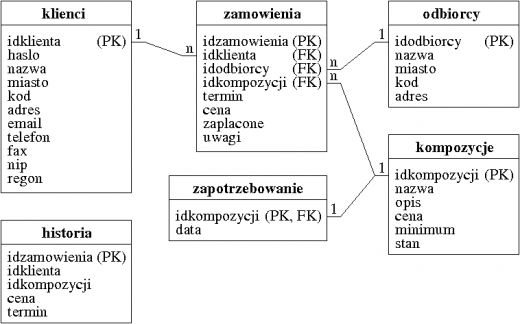

# Treść zadań do ćwiczeń z lab 9

1. Przygotuj skrypt kwiaciarnia.sql implementujący bazę danych kwiaciarnia zgodnie z przedstawionym poniżej projektem.  
Uwaga: Baza danych kwiaciarnia ma zostać umieszczona w schemacie kwiaciarnia.  
  
